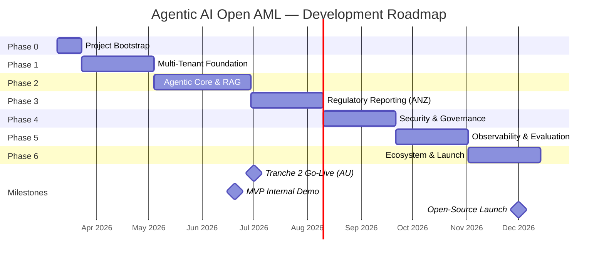

# Agentic AI Open AML — Development Plan

> **Version:** 1.0 · **Date:** 6 March 2026 · **Author:** Engineering & Architecture Lead
> **Status:** DRAFT — Pending Stakeholder Review

---

## 1. Executive Summary

This document translates the market research in `plan.md` into an actionable, phased development roadmap for an **open-source, Agentic AI–powered AML platform**. The plan is shaped by three forces:

| Force | Implication |
|---|---|
| **Market window** | ANZ Tranche 2 obligations start **1 July 2026** — ~100K new entities need affordable compliance tooling. First-mover advantage is real. |
| **Technology shift** | The industry is moving from rule-based engines → agentic AI with RAG, explainability, and multi-agent orchestration. 90% of FIs will use AI/ML for AML by end-2026. |
| **FRAML convergence** | Fraud + AML unified platforms are growing at 19.3% CAGR. Building FRAML-ready architecture from day one avoids costly re-architecture later. |

### Strategic Positioning

We target the **mid-market and Tranche 2 demographic** (lawyers, accountants, real estate, fintechs) — underserved by enterprise incumbents (Oracle, SAS, NICE Actimize) and priced-out by proprietary AI-native vendors (Unit21, SymphonyAI). Our differentiation:

- **Open source** — transparency, auditability, community-driven typologies
- **AWS Bedrock native** — managed AI infrastructure, model-agnostic swapping
- **ANZ-first, globally extensible** — AUSTRAC/NZ FIU reporting baked in, pluggable for FinCEN/FCA
- **Explainable by default** — every agent decision has a traceable reasoning chain

---

## 2. Architecture Principles

Before diving into phases, every technical decision should be measured against these principles:

| # | Principle | Rationale |
|---|---|---|
| 1 | **Modular & Composable** | Microservices/modular monolith over monolith. Each agent, tool, and pipeline is independently deployable. |
| 2 | **Multi-Tenant by Design** | Bridge pattern for RAG knowledge bases (shared infra, isolated data per `tenant_id`). AWS Bedrock AgentCore for tenant context propagation. |
| 3 | **Explainability First (XAI)** | ISO 42001–aligned audit trail for every LLM invocation. White-box reasoning visible to analysts and regulators. |
| 4 | **API-First** | RESTful + event-driven APIs. CRM-native integrations (Salesforce, Xero) for Tranche 2 firms. |
| 5 | **FRAML-Ready** | Unified data model accommodating both fraud signals and AML typologies from inception. |
| 6 | **Cost-Aware AI** | Token budgeting, context compression, and per-tenant cost attribution. AI spend must be measurable and optimisable. |

---

## 3. Development Phases

### Phase 0: Project Bootstrap & Developer Experience (Weeks 1–2)

> **Goal:** Establish the development foundation — repo structure, CI/CD, local dev environment, and coding standards.

| ID | Task | Type | Description |
|---|---|---|---|
| P0-01 | Monorepo scaffold | DevOps | Set up project structure: `/backend`, `/frontend`, `/agents`, `/infra`, `/docs`. Python (backend), TypeScript/React (frontend). |
| P0-02 | CI/CD pipeline | DevOps | GitHub Actions: lint → test → build → deploy (staging). Infrastructure-as-Code with Terraform/CDK for AWS resources. |
| P0-03 | Local dev environment | DevOps | Docker Compose for local Postgres, Redis, vector DB (Milvus). Mock Bedrock endpoint for offline development. |
| P0-04 | ADR (Architecture Decision Records) | Docs | Document key decisions: language choices, DB selections, auth strategy, tenant isolation model. |
| P0-05 | Coding standards & contribution guide | Docs | Open-source community guidelines, PR templates, issue templates, security policy. |

**Exit Criteria:** Any developer can `git clone` → `docker compose up` → have the full stack running locally within 15 minutes.

---

### Phase 1: Multi-Tenant Foundation & Secure AI Infrastructure (Weeks 3–8)

> **Goal:** Secure, tenant-isolated platform with model abstraction layer and cost tracking. This is the "chassis" on which all agents ride.

#### Backend

| ID | Task | Description | Key Technical Decisions |
|---|---|---|---|
| BE-101 | **Bedrock Abstraction Layer** | Unified client wrapping AWS Bedrock. Supports Claude 3.5 Sonnet (reasoning), Titan (embeddings), with hot-swappable model registry. | Use `boto3` with async support. Abstract via `ModelProvider` interface so non-Bedrock models (Ollama for local dev) can be plugged in. |
| BE-102 | **Multi-Tenant Data Layer** | PostgreSQL with Row-Level Security (RLS) per `tenant_id`. Vector DB (Milvus) with namespace isolation per tenant for RAG. | Bridge pattern: shared infrastructure, logically isolated data. Tenant context injected at middleware level. |
| BE-103 | **Token Usage & Cost Tracking** | Middleware decorator `@track_tokens` on all LLM calls. Stores model, token count, latency, tenant, cost per invocation. | Use Bedrock's `requestMetadata` for native cost attribution. Dashboard data feeds into Phase 4 observability. |
| BE-104 | **Authentication & Authorisation** | Multi-tenant auth: JWT with tenant claims. RBAC: Admin, Compliance Officer, Analyst, Auditor roles. | AWS Cognito or Keycloak. Tenant onboarding API for self-service registration. |
| BE-105 | **Core Data Models** | Define entities: `Tenant`, `User`, `Customer`, `Transaction`, `Alert`, `Case`, `SARReport`. FRAML-ready schema. | Use event sourcing for audit-critical entities (Cases, Alerts). Designed for both fraud and AML signals from day one. |

#### Frontend

| ID | Task | Description |
|---|---|---|
| FE-101 | **Tenant Configuration Portal** | Admin UI: risk appetite sliders, model selection, cost thresholds, user management. |
| FE-102 | **Design System & Shell** | Component library (shadcn/ui or custom), app shell with sidebar navigation, dark/light mode, responsive layout. |

**Exit Criteria:** Multi-tenant API serving requests with full data isolation. Cost per LLM call tracked. Auth flow working end-to-end.

---

### Phase 2: Agentic Core — Orchestration, RAG & Tools (Weeks 9–16)

> **Goal:** Build the "brain" — the agent orchestrator that plans, reasons, and executes multi-step AML investigations using tools and RAG context.

#### Backend

| ID | Task | Description | Key Technical Decisions |
|---|---|---|---|
| BE-201 | **RAG Pipeline & Context Optimiser** | Ingest regulatory documents, internal policies, and typology libraries into tenant-scoped vector store. Retrieve and compress context before feeding to agent. | Hybrid Search (BM25 + Dense Vectors) for exact term matching. Context compression via extractive summarisation to reduce token cost by 40–60%. |
| BE-202 | **Agent Orchestrator (Reasoning Engine)** | Core agentic loop: Observe → Think → Plan → Act → Reflect. Supports multi-step investigation workflows. | ReAct pattern with tool-use. Built on LangGraph or custom Python state machine. Configurable planning depth per alert severity. |
| BE-203 | **Tool Registry & MCP Integration** | Pluggable tools: Sanctions Screening, PEP Check, Adverse Media Search, Transaction Lookup, Corporate Structure Unwrapping, OSINT Collector. | Model Context Protocol (MCP) for external data sources. Each tool is an independent service with its own rate limits and fallback. |
| BE-204 | **Specialised Agent Definitions** | Purpose-built agents: `SanctionsAgent`, `TransactionMonitorAgent`, `CDD Agent`, `SARNarrativeAgent`, `ElderAbuseAgent`. | Each agent has a system prompt, tool whitelist, and risk threshold. Agents can delegate to sub-agents (multi-agent collaboration). |
| BE-205 | **Alert Triage & Prioritisation** | Automated alert scoring. False positive auto-clearance for low-risk alerts (target: 90%+ reduction). Escalation rules to human analysts. | ML-based scoring model trained on historical alert data. Configurable thresholds per tenant risk appetite. |
| BE-206 | **Transaction Monitoring Engine** | Real-time and batch transaction monitoring against configurable rule sets and anomaly detection models. | Event-driven architecture (Kafka/SQS). Rule engine for deterministic patterns + ML for anomaly detection. |

#### Frontend

| ID | Task | Description |
|---|---|---|
| FE-201 | **XAI "Glass Box" Investigation View** | Timeline showing every agent step: what it observed, what tool it called, what data it retrieved, what it concluded, and why. |
| FE-202 | **Alert Queue & Case Management** | Analyst workspace: alert list with severity/priority, case assignment, investigation notes, evidence attachments. |
| FE-203 | **Agent Chat Interface** | Conversational interface for analysts to interact with agents: ask follow-up questions, request deeper investigation, challenge conclusions. |

**Exit Criteria:** An agent can receive an alert, autonomously investigate it (calling 3+ tools), produce an explained recommendation, and present it to an analyst in the UI.

---

### Phase 3: Regulatory Reporting & ANZ Compliance (Weeks 17–22)

> **Goal:** Automated regulatory reporting for AUSTRAC (Australia) and NZ FIU. SAR/SMR narrative generation. Tranche 2 entity onboarding.

#### Backend

| ID | Task | Description | Key Technical Decisions |
|---|---|---|---|
| BE-301 | **SAR/SMR Narrative Agent** | Agent that drafts regulator-ready Suspicious Activity/Matter Reports from case data. Supports AUSTRAC SMR, TTR, IFTI formats and NZ SAR format. | Chain of Verification: agent drafts → self-validates → flags inconsistencies. Human review before submission. Template-driven for regulatory format compliance. |
| BE-302 | **KYC/CDD Automation Pipeline** | Automated customer onboarding: ID verification, PEP screening, sanctions check, adverse media scan, risk scoring. | Designed for Tranche 2 entities (lawyers, accountants, real estate). Integrates with AU/NZ identity verification services. Target: 70% full automation. |
| BE-303 | **Regulatory Report Submission API** | Programmatic submission of reports to AUSTRAC (via AUSTRAC Online) and NZ FIU. | Retry logic, receipt tracking, submission audit trail. Supports both API and file-based submission. |
| BE-304 | **Entity Unwrapping & Corporate Structure Analysis** | Recursively resolve beneficial ownership through company registries (ASIC, NZBN). | Graph-based entity resolution. Visualise complex ownership structures. Critical for Tranche 2 real estate/legal. |
| BE-305 | **Configurable Rule Engine** | Allow tenants to define custom transaction monitoring rules, thresholds, and typologies without code changes. | YAML/JSON rule definitions. Version-controlled. Hot-reloadable without restart. |

#### Frontend

| ID | Task | Description |
|---|---|---|
| FE-301 | **SAR/SMR Editor & Review** | Side-by-side view: AI-drafted narrative + source evidence. Inline editing, approval workflow, submission tracking. |
| FE-302 | **KYC Dashboard** | Customer onboarding progress, risk scoring breakdown, identity verification status, CDD checklist. |
| FE-303 | **Corporate Structure Visualiser** | Interactive graph showing beneficial ownership, UBO paths, risk indicators on each entity. |

**Exit Criteria:** End-to-end flow: transaction triggers alert → agent investigates → drafts SMR/SAR → analyst reviews/edits → report submitted to AUSTRAC/NZ FIU.

---

### Phase 4: Security, Governance & Responsible AI (Weeks 23–28)

> **Goal:** Harden the platform for production. ISO 42001 governance. Prompt injection protection. Bias monitoring.

#### Backend

| ID | Task | Description | Key Technical Decisions |
|---|---|---|---|
| BE-401 | **AI Security & Guardrails** | Integrate AWS Bedrock Guardrails: content filtering, PII redaction, prompt injection detection, topic denial. | Defence-in-depth: input validation → Bedrock guardrails → output validation → PII scan. Red team testing as part of CI. |
| BE-402 | **ISO 42001 Governance Logging** | Immutable audit trail for every AI decision: model version, temperature, system prompt hash, input/output, reasoning chain, human override (if any). | Append-only log (S3 + DynamoDB). Tamper-evident via hash chaining. Queryable for regulatory audits. |
| BE-403 | **Data Retention & Privacy** | Configurable data retention policies per tenant and jurisdiction. GDPR/Privacy Act 2020 compliance. Right-to-deletion support. | Soft-delete with scheduled hard-delete. Tenant-configurable retention periods. Encrypted at rest (AES-256) and in transit (TLS 1.3). |
| BE-404 | **Role-Based Access Control Hardening** | Fine-grained permissions: who can approve SARs, who can override agent decisions, who can view PII. | Attribute-based access control (ABAC) layered on RBAC. Tenant-level permission customisation. |
| BE-405 | **Model Inventory & Lifecycle** | Registry of all models in use: version, purpose, training data lineage, performance metrics. Supports model retirement and replacement workflows. | Critical for ISO 42001. Enables "which model made this decision?" traceability. |

#### Frontend

| ID | Task | Description |
|---|---|---|
| FE-401 | **Responsible AI Dashboard** | Compliance officer view: model accuracy trends, bias metrics (demographic parity, equalised odds), false positive/negative rates by segment. |
| FE-402 | **Audit Trail Explorer** | Search and filter AI decision logs by date, tenant, agent, case, model. Export for regulatory submission. |

**Exit Criteria:** Platform passes internal security review. ISO 42001 audit trail complete. No PII leakage in agent outputs. Bias monitoring active on all production models.

---

### Phase 5: Observability, Evaluation & Continuous Improvement (Weeks 29–34)

> **Goal:** Production-grade observability, automated agent quality evaluation, and human-in-the-loop feedback loops for continuous improvement.

#### Backend

| ID | Task | Description | Key Technical Decisions |
|---|---|---|---|
| BE-501 | **LLM-as-a-Judge Pipeline** | Automated evaluation: a stronger model (Claude 3 Opus / GPT-4o) grades agent investigation quality against a "Golden Dataset" of 500+ labelled cases. | Evaluates: accuracy, completeness, reasoning quality, regulatory language compliance. Runs nightly as CI job. |
| BE-502 | **OpenTelemetry Instrumentation** | Distributed tracing across all agent steps, tool calls, RAG retrievals, and LLM invocations. | Integration with Grafana/Prometheus or AWS CloudWatch. Latency, error rate, and token usage dashboards. Agent loop detection (infinite reasoning cycles). |
| BE-503 | **A/B Testing Framework** | Compare agent configurations (different prompts, models, temperature) on identical alert sets. | Feature flagging per tenant. Statistical significance testing before rollout. |
| BE-504 | **Golden Dataset Curation** | Manage curated test cases with known-good outcomes for regression testing and model evaluation. | Versioned dataset with community contributions. Covers diverse typologies: sanctions, PEPs, adverse media, transaction patterns. |

#### Frontend

| ID | Task | Description |
|---|---|---|
| FE-501 | **Human Feedback (RLHF) Widget** | Analysts rate agent output (👍/👎), correct errors, annotate reasoning. Feedback stored for fine-tuning and prompt optimisation. |
| FE-502 | **Observability Dashboard** | Real-time: agent throughput, latency P50/P95/P99, error rates, cost per investigation, model performance trends. |

**Exit Criteria:** Automated evaluation pipeline running nightly. Agent quality score > 85% on Golden Dataset. P95 investigation latency < 30 seconds. Analyst feedback loop generating training signal.

---

### Phase 6: Ecosystem Integrations & Market Readiness (Weeks 35–40)

> **Goal:** CRM-native integrations, multi-jurisdictional support, and open-source community launch.

#### Backend

| ID | Task | Description | Key Technical Decisions |
|---|---|---|---|
| BE-601 | **CRM Integrations** | Native connectors for Salesforce, Xero, MYOB — enabling Tranche 2 firms to run checks without leaving their operating systems. | Plugin architecture. OAuth2 flows. Bidirectional sync (customer data in, risk scores out). |
| BE-602 | **Multi-Jurisdiction Regulatory Module** | Pluggable regulatory adapters: AUSTRAC (AU), FIU (NZ), FinCEN (US), FCA (UK). | Shared investigation engine, jurisdiction-specific reporting formats, thresholds, and required fields. |
| BE-603 | **Webhook & Event Platform** | External event consumers: alert triggers, case status changes, report submissions. Enable third-party integrations. | Webhook registry with retry, dead-letter queue, and signature verification. |
| BE-604 | **Federated Typology Sharing** | Community-contributed money laundering typologies shared across tenants without exposing sensitive data. | Inspired by Tookitaki's federated model. Typology definitions as versioned YAML. Privacy-preserving aggregation. |

#### Frontend

| ID | Task | Description |
|---|---|---|
| FE-601 | **Marketplace / Plugin Gallery** | Browse and install community-built tools, typologies, report templates, and agent configurations. |
| FE-602 | **Multi-language Support (i18n)** | Interface localisation: English, Māori, Mandarin for ANZ market. Extensible for other locales. |

#### Community & Launch

| ID | Task | Description |
|---|---|---|
| C-601 | **Documentation Site** | Docusaurus/MkDocs site: getting started, architecture guide, API reference, contribution guide. |
| C-602 | **Demo Environment** | Hosted sandbox with synthetic data for potential users to evaluate the platform. |
| C-603 | **Open-Source Launch** | Apache 2.0 / MIT licence. GitHub release. Product Hunt / Hacker News launch. Conference submissions (KYC360, ACAMS). |

**Exit Criteria:** At least 2 CRM integrations live. Multi-jurisdiction reporting working for AU + NZ. Documentation site published. Community contribution workflow tested.

---

## 4. Technology Stack Summary

| Layer | Technology | Rationale |
|---|---|---|
| **LLM Provider** | AWS Bedrock (Claude 3.5 Sonnet, Titan Embeddings) | Managed, model-agnostic, enterprise-grade. Guardrails built-in. |
| **Backend** | Python 3.12+ (FastAPI) | Async-first, rich AI/ML ecosystem, rapid development. |
| **Frontend** | TypeScript + React (Next.js or Vite) | Type safety, component ecosystem, SSR for dashboard performance. |
| **Database** | PostgreSQL 16 (with RLS) | Multi-tenant isolation, JSONB for flexible schemas, mature ecosystem. |
| **Vector DB** | Milvus (or Pinecone) | Tenant-namespaced RAG. Milvus for self-hosted/open-source alignment. |
| **Message Queue** | AWS SQS / Kafka | Event-driven transaction monitoring. Decoupled agent orchestration. |
| **Cache** | Redis | Session management, rate limiting, hot data caching. |
| **Search** | OpenSearch | Full-text search across cases, customers, and regulatory documents. |
| **Observability** | OpenTelemetry + Grafana | Vendor-neutral tracing. LLM-specific metrics. |
| **IaC** | Terraform / AWS CDK | Reproducible environments. Multi-account hub-and-spoke for tenants. |
| **CI/CD** | GitHub Actions | Native to open-source workflow. |
| **Auth** | Keycloak (or AWS Cognito) | Multi-tenant OIDC. RBAC + ABAC. |

---

## 5. Timeline & Milestones

> [!IMPORTANT]
> **Tranche 2 deadline alignment:** Phase 3 (Regulatory Reporting) must be substantially complete before **1 July 2026** to capture the Tranche 2 market wave. This is a hard constraint. Consider running Phases 2 & 3 in parallel with separate teams if resources allow.

---

## 6. Risk Register

| # | Risk | Impact | Likelihood | Mitigation |
|---|---|---|---|---|
| R1 | Bedrock model quality/availability changes | High | Medium | Model abstraction layer (BE-101) enables hot-swap. Maintain fallback to Anthropic API direct. |
| R2 | Tranche 2 regulatory requirements still evolving | High | Medium | Close engagement with AUSTRAC. Configurable rule engine (BE-305) absorbs changes without code releases. |
| R3 | High false positive rates undermine analyst trust | High | Low | LLM-as-a-Judge evaluation (BE-501) + analyst feedback loop (FE-501). Target: < 10% false positive rate. |
| R4 | Token costs exceed revenue at scale | Medium | Medium | Context optimiser (BE-201), per-tenant cost tracking (BE-103), tiered pricing model. |
| R5 | Prompt injection / adversarial attacks | Critical | Medium | Multi-layer guardrails (BE-401). Regular red-team exercises. Input/output validation. |
| R6 | Open-source community adoption slow | Medium | Medium | Strong docs (C-601), demo environment (C-602), conference presence, Tranche 2 pain-point marketing. |

---

## 7. Success Metrics

| Metric | Target (6 months post-launch) | Measurement |
|---|---|---|
| False positive reduction | ≥ 90% vs. rule-based baseline | A/B test against traditional rule engine |
| Investigation time | ≤ 5 minutes (agent-assisted) vs. 45 min manual | Case completion time tracking |
| SAR/SMR quality score | ≥ 85% LLM-as-a-Judge score | Automated evaluation pipeline |
| Tenant onboarding time | ≤ 1 hour self-service | Onboarding funnel analytics |
| Cost per investigation | ≤ $0.50 average | Token usage + compute tracking |
| Open-source stars | ≥ 500 GitHub stars | GitHub metrics |
| Active community contributors | ≥ 20 | PR/issue tracking |

---

## 8. Team Structure (Recommended)

| Squad | Focus | Size |
|---|---|---|
| **Platform** | Multi-tenant infra, auth, data layer, CI/CD | 2–3 engineers |
| **Agents** | Orchestrator, RAG pipeline, tools, specialised agents | 3–4 engineers |
| **Compliance** | Regulatory reporting, KYC/CDD, rule engine | 2–3 engineers |
| **Frontend** | UI/UX, dashboards, investigation workspace | 2 engineers |
| **Security & Governance** | Guardrails, audit logging, ISO 42001 | 1–2 engineers |
| **DevRel & Docs** | Documentation, community, demos | 1 engineer |

> [!TIP]
> For a lean start (≤ 5 engineers), collapse into 2 squads: **Platform + Agents** and **Compliance + Frontend**. Security is a shared responsibility. Phases 0–2 are achievable with this structure.

---

## 9. Comparison with Original Plan

| Aspect | Original `plan.md` | This `development-plan.md` |
|---|---|---|
| **Phases** | 4 phases (Foundation → Agentic → Security → Observability) | 7 phases (adds Bootstrap, Regulatory Reporting, Ecosystem) |
| **ANZ/Tranche 2** | Mentioned in research only | Dedicated Phase 3 with AUSTRAC/NZ FIU reporting, entity unwrapping, KYC automation |
| **FRAML** | Not addressed | FRAML-ready data model from Phase 1. Unified risk schema. |
| **Regulatory Reporting** | Not addressed | SAR/SMR narrative agent, automated submission, multi-jurisdiction support |
| **CRM Integration** | Not addressed | Phase 6: Salesforce, Xero, MYOB connectors for Tranche 2 firms |
| **Community/Open-Source** | Not addressed | Phase 6: docs site, demo env, launch strategy |
| **Task IDs** | Generic (BE-101, FE-201) | Maintained + expanded with clear descriptions and technical decisions |
| **Timeline** | No dates | 40-week roadmap with Tranche 2 deadline alignment |
| **Risk Register** | None | 6 identified risks with mitigations |
| **Success Metrics** | None | 7 measurable targets |
| **Team Structure** | None | Squad-based recommendation with lean alternative |

---

## 10. Next Steps

1. **Stakeholder review** of this plan — identify any missing requirements or re-prioritisations
2. **Phase 0 kickoff** — repo scaffold, CI/CD, local dev environment
3. **ADR #1** — finalise multi-tenancy model (bridge vs. silo) based on target customer scale
4. **ADR #2** — agent orchestration framework (LangGraph vs. custom state machine)
5. **Community interest validation** — share plan overview on relevant forums/channels

---

*This is a living document. It will be updated as we learn from implementation, user feedback, and evolving regulatory requirements.*
